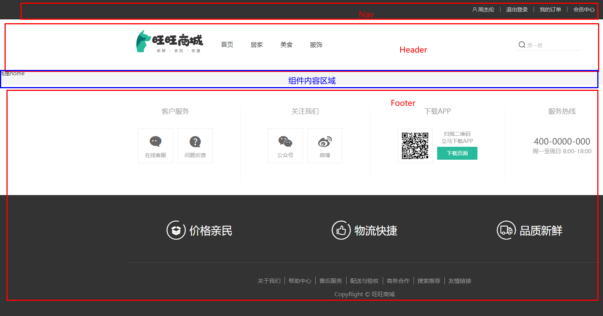
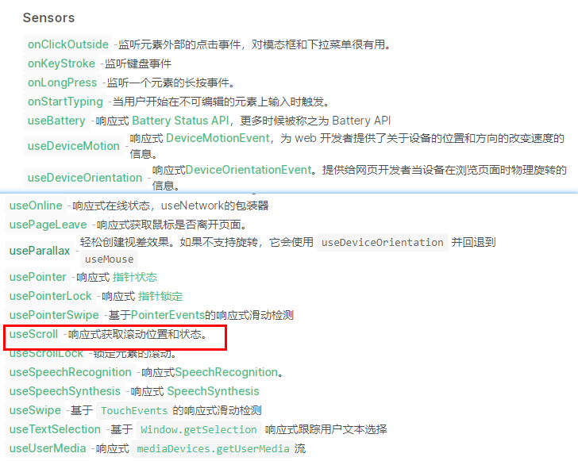

# 2-1 搭建组件结构

##页面结构分析




项目目录结构


##LayoutNav.vue

```vue
<script setup>

</script>

<template>
  <nav class="app-topnav">
    <div class="container">
      <ul>
        <template v-if="true">
          <li><a href="javascript:;"><i class="iconfont icon-user"></i>周杰伦</a></li>
          <li>
            <el-popconfirm title="确认退出吗?" confirm-button-text="确认" cancel-button-text="取消">
              <template #reference>
                <a href="javascript:;">退出登录</a>
              </template>
            </el-popconfirm>
          </li>
          <li><a href="javascript:;">我的订单</a></li>
          <li><a href="javascript:;">会员中心</a></li>
        </template>
        <template v-else>
          <li><a href="javascript:;">请先登录</a></li>
          <li><a href="javascript:;">帮助中心</a></li>
          <li><a href="javascript:;">关于我们</a></li>
        </template>
      </ul>
    </div>
  </nav>
</template>


<style scoped lang="scss">
.app-topnav {
  background: #333;
  ul {
    display: flex;
    height: 53px;
    justify-content: flex-end;
    align-items: center;
    li {
      a {
        padding: 0 15px;
        color: #cdcdcd;
        line-height: 1;
        display: inline-block;

        i {
          font-size: 14px;
          margin-right: 2px;
        }

        &:hover {
          color: $xtxColor;
        }
      }

      ~li {
        a {
          border-left: 2px solid #666;
        }
      }
    }
  }
}
</style>
```

##LayoutHeader.vue

```vue
<script setup>

</script>

<template>
  <header class='app-header'>
    <div class="container">
      <h1 class="logo">
        <RouterLink to="/">旺旺商城</RouterLink>
      </h1>
      <ul class="app-header-nav">
        <li class="home">
          <RouterLink to="/">首页</RouterLink>
        </li>
        <li> <RouterLink to="/">居家</RouterLink> </li>
        <li> <RouterLink to="/">美食</RouterLink> </li>
        <li> <RouterLink to="/">服饰</RouterLink> </li>
      </ul>
      <div class="search">
        <i class="iconfont icon-search"></i>
        <input type="text" placeholder="搜一搜">
      </div>
      <!-- 头部购物车 -->
      
    </div>
  </header>
</template>


<style scoped lang='scss'>
.app-header {
  background: #fff;

  .container {
    display: flex;
    align-items: center;
  }

  .logo {
    width: 200px;

    a {
      display: block;
      height: 132px;
      width: 100%;
      text-indent: -9999px;
      background: url('@/assets/images/logo.png') no-repeat center 18px / contain;
    }
  }

  .app-header-nav {
    width: 820px;
    display: flex;
    padding-left: 40px;
    position: relative;
    z-index: 998;
  
    li {
      margin-right: 40px;
      width: 38px;
      text-align: center;
  
      a {
        font-size: 16px;
        line-height: 32px;
        height: 32px;
        display: inline-block;
  
        &:hover {
          color: $xtxColor;
          border-bottom: 1px solid $xtxColor;
        }
      }
  
      .active {
        color: $xtxColor;
        border-bottom: 1px solid $xtxColor;
      }
    }
  }

  .search {
    width: 170px;
    height: 32px;
    position: relative;
    border-bottom: 1px solid #e7e7e7;
    line-height: 32px;

    .icon-search {
      font-size: 18px;
      margin-left: 5px;
    }

    input {
      width: 140px;
      padding-left: 5px;
      color: #666;
    }
  }

  .cart {
    width: 50px;

    .curr {
      height: 32px;
      line-height: 32px;
      text-align: center;
      position: relative;
      display: block;

      .icon-cart {
        font-size: 22px;
      }

      em {
        font-style: normal;
        position: absolute;
        right: 0;
        top: 0;
        padding: 1px 6px;
        line-height: 1;
        background: $helpColor;
        color: #fff;
        font-size: 12px;
        border-radius: 10px;
        font-family: Arial;
      }
    }
  }
}
</style>
```

##LayoutFooter.vue

```vue
<template>
  <footer class="app_footer">
    <!-- 联系我们 -->
    <div class="contact">
      <div class="container">
        <dl>
          <dt>客户服务</dt>
          <dd><i class="iconfont icon-kefu"></i> 在线客服</dd>
          <dd><i class="iconfont icon-question"></i> 问题反馈</dd>
        </dl>
        <dl>
          <dt>关注我们</dt>
          <dd><i class="iconfont icon-weixin"></i> 公众号</dd>
          <dd><i class="iconfont icon-weibo"></i> 微博</dd>
        </dl>
        <dl>
          <dt>下载APP</dt>
          <dd class="qrcode"></dd>
          <dd class="download">
            <span>扫描二维码</span>
            <span>立马下载APP</span>
            <a href="javascript:;">下载页面</a>
          </dd>
        </dl>
        <dl>
          <dt>服务热线</dt>
          <dd class="hotline">400-0000-000 <small>周一至周日 8:00-18:00</small></dd>
        </dl>
      </div>
    </div>
    <!-- 其它 -->
    <div class="extra">
      <div class="container">
        <div class="slogan">
          <a href="javascript:;">
            <i class="iconfont icon-footer01"></i>
            <span>价格亲民</span>
          </a>
          <a href="javascript:;">
            <i class="iconfont icon-footer02"></i>
            <span>物流快捷</span>
          </a>
          <a href="javascript:;">
            <i class="iconfont icon-footer03"></i>
            <span>品质新鲜</span>
          </a>
        </div>
        <!-- 版权信息 -->
        <div class="copyright">
          <p>
            <a href="javascript:;">关于我们</a>
            <a href="javascript:;">帮助中心</a>
            <a href="javascript:;">售后服务</a>
            <a href="javascript:;">配送与验收</a>
            <a href="javascript:;">商务合作</a>
            <a href="javascript:;">搜索推荐</a>
            <a href="javascript:;">友情链接</a>
          </p>
          <p>CopyRight © 旺旺商城</p>
        </div>
      </div>
    </div>
  </footer>
</template>

<style scoped lang='scss'>
.app_footer {
  overflow: hidden;
  background-color: #f5f5f5;
  padding-top: 20px;

  .contact {
    background: #fff;

    .container {
      padding: 60px 0 40px 25px;
      display: flex;
    }

    dl {
      height: 190px;
      text-align: center;
      padding: 0 72px;
      border-right: 1px solid #f2f2f2;
      color: #999;

      &:first-child {
        padding-left: 0;
      }

      &:last-child {
        border-right: none;
        padding-right: 0;
      }
    }

    dt {
      line-height: 1;
      font-size: 18px;
    }

    dd {
      margin: 36px 12px 0 0;
      float: left;
      width: 92px;
      height: 92px;
      padding-top: 10px;
      border: 1px solid #ededed;

      .iconfont {
        font-size: 36px;
        display: block;
        color: #666;
      }

      &:hover {
        .iconfont {
          color: $xtxColor;
        }
      }

      &:last-child {
        margin-right: 0;
      }
    }

    .qrcode {
      width: 92px;
      height: 92px;
      padding: 7px;
      border: 1px solid #ededed;
    }

    .download {
      padding-top: 5px;
      font-size: 14px;
      width: auto;
      height: auto;
      border: none;

      span {
        display: block;
      }

      a {
        display: block;
        line-height: 1;
        padding: 10px 25px;
        margin-top: 5px;
        color: #fff;
        border-radius: 2px;
        background-color: $xtxColor;
      }
    }

    .hotline {
      padding-top: 20px;
      font-size: 22px;
      color: #666;
      width: auto;
      height: auto;
      border: none;

      small {
        display: block;
        font-size: 15px;
        color: #999;
      }
    }
  }

  .extra {
    background-color: #333;
  }

  .slogan {
    height: 178px;
    line-height: 58px;
    padding: 60px 100px;
    border-bottom: 1px solid #434343;
    display: flex;
    justify-content: space-between;

    a {
      height: 58px;
      line-height: 58px;
      color: #fff;
      font-size: 28px;

      i {
        font-size: 50px;
        vertical-align: middle;
        margin-right: 10px;
        font-weight: 100;
      }

      span {
        vertical-align: middle;
        text-shadow: 0 0 1px #333;
      }
    }
  }

  .copyright {
    height: 170px;
    padding-top: 40px;
    text-align: center;
    color: #999;
    font-size: 15px;

    p {
      line-height: 1;
      margin-bottom: 20px;
    }

    a {
      color: #999;
      line-height: 1;
      padding: 0 10px;
      border-right: 1px solid #999;

      &:last-child {
        border-right: none;
      }
    }
  }
}
</style>
```

##index.vue

```vue
<script setup>
import LayoutNav from "@/views/Layout/components/LayoutNav.vue";
import LayoutHeader from "@/views/Layout/components/LayoutHeader.vue";
import LayoutFooter from "@/views/Layout/components/LayoutFooter.vue";
</script>

<template>
  <LayoutNav></LayoutNav>
  <LayoutHeader></LayoutHeader>
  <RouterView/>
  <LayoutFooter></LayoutFooter>
</template>

<style scoped>

</style>
```


# 2-2 阿里字体图标渲染

> 字体图标采用的是阿里的字体图标库，样式文件已经准备好，在 `index.html`文件中引入即可

```html
  <link rel="stylesheet" href="//at.alicdn.com/t/font_2143783_iq6z4ey5vu.css">
```
阿里图标矢量图 

https://www.iconfont.cn

阿里图标引用讲解


# 2-3 Header导航动态渲染


**实现步骤**

1. 封装接口函数
2. 调用接口函数
3. v-for渲染模版

**代码落地**

##创建apis/layout.js

```javascript
import http from "@/utils/http";

export function getCategoryAPI(){
    return http.get('home/category/head');
}
```
##重构LayoutHeader.vue

```vue
<script setup>
import {onMounted, ref} from "vue";
import {getCategoryAPI} from "@/apis/layout";

const categoryList = ref([]);
const getCategory = async ()=>{
  let res = await getCategoryAPI();
  console.log(res.result);
  categoryList.value = res.result;
}
onMounted(()=>{
  getCategory();
})
</script>

<template>
  ...
     <ul class="app-header-nav">
        <li class="home">
          <RouterLink to="/">首页</RouterLink>
        </li>
        <li v-for="item in categoryList" :key="item.id">
          <RouterLink to="/">{{item.name}}</RouterLink>
        </li>

      </ul>
</template>
```


# 2-4 吸顶导航交互实现

## 创建吸顶导航组件

创建LayoutFixed.vue

```vue
<script setup>

</script>

<template>
  <div class="app-header-sticky">
    <div class="container">
      <RouterLink class="logo" to="/" />
      <!-- 导航区域 -->
      <ul class="app-header-nav ">
        <li class="home">
          <RouterLink to="/">首页</RouterLink>
        </li>
        <li>
          <RouterLink to="/">居家</RouterLink>
        </li>
        <li>
          <RouterLink to="/">美食</RouterLink>
        </li>
        <li>
          <RouterLink to="/">服饰</RouterLink>
        </li>
        <li>
          <RouterLink to="/">母婴</RouterLink>
        </li>
        <li>
          <RouterLink to="/">个护</RouterLink>
        </li>
        <li>
          <RouterLink to="/">严选</RouterLink>
        </li>
        <li>
          <RouterLink to="/">数码</RouterLink>
        </li>
        <li>
          <RouterLink to="/">运动</RouterLink>
        </li>
        <li>
          <RouterLink to="/">杂项</RouterLink>
        </li>
      </ul>

      <div class="right">
        <RouterLink to="/">品牌</RouterLink>
        <RouterLink to="/">专题</RouterLink>
      </div>
    </div>
  </div>
</template>


<style scoped lang='scss'>
.app-header-sticky {
  width: 100%;
  height: 80px;
  position: fixed;
  left: 0;
  top: 0;
  z-index: 999;
  background-color: #fff;
  border-bottom: 1px solid #e4e4e4;
  // 此处为关键样式!!!
  // 状态一：往上平移自身高度 + 完全透明
  transform: translateY(-100%);
  opacity: 0;

  // 状态二：移除平移 + 完全不透明
  &.show {
    transition: all 0.3s linear;
    transform: none;
    opacity: 1;
  }

  .container {
    display: flex;
    align-items: center;
  }

  .logo {
    width: 200px;
    height: 80px;
    background: url("@/assets/images/logo.png") no-repeat right 2px;
    background-size: 160px auto;
  }

  .right {
    width: 220px;
    display: flex;
    text-align: center;
    padding-left: 40px;
    border-left: 2px solid $xtxColor;

    a {
      width: 38px;
      margin-right: 40px;
      font-size: 16px;
      line-height: 1;

      &:hover {
        color: $xtxColor;
      }
    }
  }
}

.app-header-nav {
  width: 820px;
  display: flex;
  padding-left: 40px;
  position: relative;
  z-index: 998;

  li {
    margin-right: 40px;
    width: 38px;
    text-align: center;

    a {
      font-size: 16px;
      line-height: 32px;
      height: 32px;
      display: inline-block;

      &:hover {
        color: $xtxColor;
        border-bottom: 1px solid $xtxColor;
      }
    }

    .active {
      color: $xtxColor;
      border-bottom: 1px solid $xtxColor;
    }
  }
}
</style>
```

看盒子效果,添加show样式

```
<template>
  <div class="app-header-sticky show">
    <div class="container">
      <RouterLink class="logo" to="/" />
      ...
```


## 实现吸顶交互

步骤1：安装依赖

依赖官网官网：https://www.vueusejs.com/

在Sensors里 可以看到监视滚动的函数 useScroll




```
npm i @vueuse/core
```


> 核心逻辑：根据滚动距离判断当前show类名是否显示，大于78显示，小于78，不显示

```vue
<script setup>
import { useScroll } from '@vueuse/core'
const { y } = useScroll(window)
</script>

<template>
  <div class="app-header-sticky" :class="{show:y>78}">
    <div class="container">
      <RouterLink class="logo" to="/" />
      <!-- 导航区域 -->
      <ul class="app-header-nav">
        <li class="home">
          <RouterLink to="/">首页{{y}}</RouterLink>
        </li>
         ...
```


# 2-5 Pinia优化重复请求

优化设计


## 创建pinia/categoryStore.js

categoryStore.js

```javascript
import { ref } from 'vue'
import { defineStore } from 'pinia'
import { getCategoryAPI } from '@/apis/layout'
export const useCategoryStore = defineStore('category', () => {
  // 导航列表的数据管理
  // state 导航列表数据
  const categoryList = ref([])

  // action 获取导航数据的方法
  const getCategory = async () => {
    const res = await getCategoryAPI()
    categoryList.value = res.result
  }
  onMounted(()=>getCategory());

  return {
    categoryList,
    getCategory
  }
})
```


## 重构组件代码

LayoutHeader.vue代码

```vue
<script setup>
import {useCategoryStore} from "@/stores/categoryStore";
const categoryStore = useCategoryStore();

</script>
```

模板

```
<li v-for="item in categoryStore.categoryList" :key="item.id">
  <RouterLink to="/">{{ item.name }}</RouterLink>
</li>
```


LayoutFixed.vue代码

```vue
<script setup>
import {useCategoryStore} from "@/stores/categoryStore";
const categoryStore = useCategoryStore();

</script>
```


# 2-6 依赖导入优化

重构vite.config.js

```
export default defineConfig({
  plugins: [
    vue(),
    // 配置插件
    AutoImport({
      imports:["vue","vue-router","pinia"],
      resolvers: [ElementPlusResolver()],
    }),
```

重构categoryStore.js

```
import {getCategoryAPI} from "@/apis/layout";

export const useCategoryStore = defineStore('category',()=>{
    const categoryList = ref([]);
    const getCategory = async () => {
        let res = await getCategoryAPI();
        categoryList.value = res.result;
    }
    return{
        categoryList,
        getCategory
    }
})
```

重构LayoutHeader.vue 与 LayoutFixed.vue