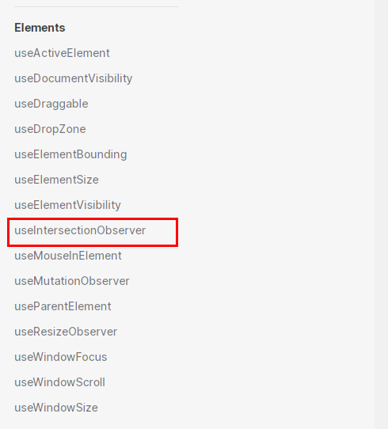
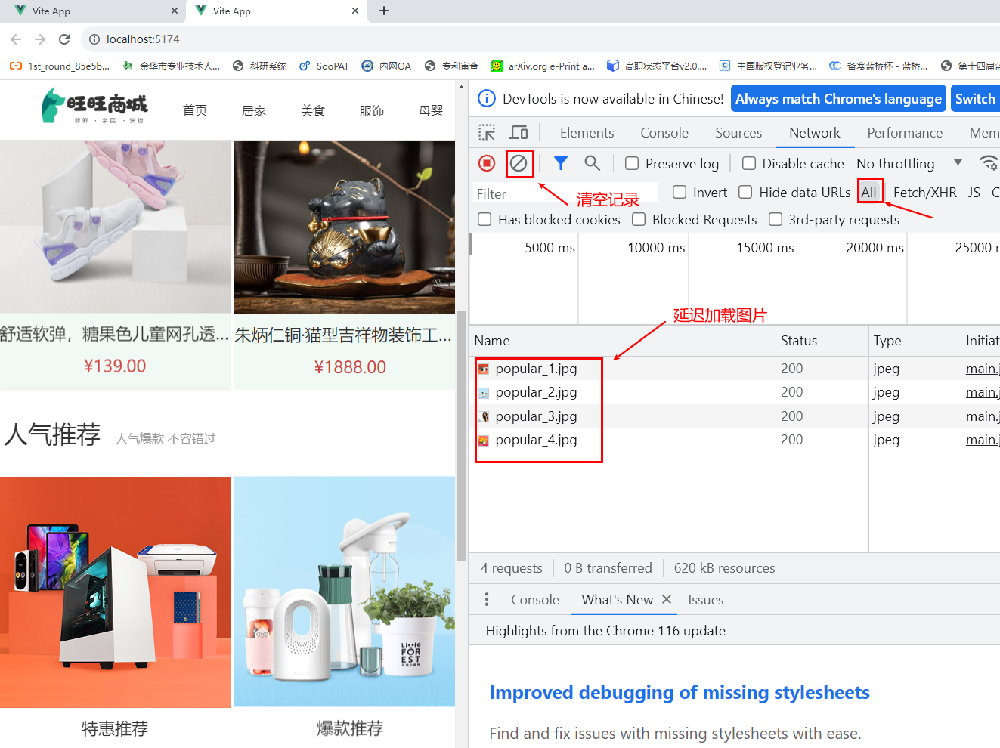

# 3-1 需求分析及整体结构创建


1- 按照结构新增五个组件，准备最简单的模版，分别在Home模块的入口组件中引入

- HomeCategory
- HomeBanner
- HomeNew
- HomeHot
- HomeProduct
```vue
<script setup>

</script>

<template>
分类
</template>

<style scoped>

</style>
```

2- Home模块入口组件中引入并渲染
```vue
<script setup>
import HomeCategory from "@/views/Home/components/HomeCategory.vue";
import HomeBanner from "@/views/Home/components/HomeBanner.vue";
import HomeNew from "@/views/Home/components/HomeNew.vue";
import HomeHot from "@/views/Home/components/HomeHot.vue";
import HomeProduct from "@/views/Home/components/HomeProduct.vue";
</script>

<template>
  <div class="container">
    <HomeCategory />
    <HomeBanner />
  </div>
  <HomeNew/>
  <HomeHot/>
  <HomeProduct/>
</template>

<style scoped>

</style>
```


#3-2-实现Category左侧分类

1- HomeCategory静态代码
```vue
<script setup>

</script>

<template>
  <div class="home-category">
    <ul class="menu">
      <li v-for="item in 9" :key="item">
        <RouterLink to="/">居家</RouterLink>
        <RouterLink v-for="i in 2" :key="i" to="/">南北干货</RouterLink>
        <!-- 弹层layer位置 -->
        <div class="layer">
          <h4>分类推荐 <small>根据您的购买或浏览记录推荐</small></h4>
          <ul>
            <li v-for="i in 5" :key="i">
              <RouterLink to="/">
                
                <div class="info">
                  <p class="name ellipsis-2">
                    男士外套
                  </p>
                  <p class="desc ellipsis">男士外套，冬季必选</p>
                  <p class="price"><i>¥</i>200.00</p>
                </div>
              </RouterLink>
            </li>
          </ul>
        </div>
      </li>
    </ul>
  </div>
</template>


<style scoped lang='scss'>
.home-category {
  width: 250px;
  height: 500px;
  background: rgba(0, 0, 0, 0.8);
  position: relative;
  z-index: 99;

  .menu {
    li {
      padding-left: 40px;
      height: 55px;
      line-height: 55px;

      &:hover {
        background: $xtxColor;
      }

      a {
        margin-right: 4px;
        color: #fff;

        &:first-child {
          font-size: 16px;
        }
      }

      .layer {
        width: 990px;
        height: 500px;
        background: rgba(255, 255, 255, 0.8);
        position: absolute;
        left: 250px;
        top: 0;
        display: none;
        padding: 0 15px;

        h4 {
          font-size: 20px;
          font-weight: normal;
          line-height: 80px;

          small {
            font-size: 16px;
            color: #666;
          }
        }

        ul {
          display: flex;
          flex-wrap: wrap;

          li {
            width: 310px;
            height: 120px;
            margin-right: 15px;
            margin-bottom: 15px;
            border: 1px solid #eee;
            border-radius: 4px;
            background: #fff;

            &:nth-child(3n) {
              margin-right: 0;
            }

            a {
              display: flex;
              width: 100%;
              height: 100%;
              align-items: center;
              padding: 10px;

              &:hover {
                background: #e3f9f4;
              }

              img {
                width: 95px;
                height: 95px;
              }

              .info {
                padding-left: 10px;
                line-height: 24px;
                overflow: hidden;

                .name {
                  font-size: 16px;
                  color: #666;
                }

                .desc {
                  color: #999;
                }

                .price {
                  font-size: 22px;
                  color: $priceColor;

                  i {
                    font-size: 16px;
                  }
                }
              }
            }
          }
        }
      }

      // 关键样式  hover状态下的layer盒子变成block
      &:hover {
        .layer {
          display: block;
        }
      }
    }
  }
}
</style>
```
2- HomeCategory动态数据绑定代码
```vue
<script setup>
import {useCategoryStore} from "@/stores/categoryStore";
const categoryStore = useCategoryStore();

</script>

<template>
  <div class="home-category">
    <ul class="menu">
      <li v-for="item in categoryStore.categoryList" :key="item.id">
        <RouterLink to="/">{{item.name}}</RouterLink>
        <RouterLink v-for="i in item.children.slice(0,2)" :key="i.id" to="/">{{i.name}}</RouterLink>
        <!-- 弹层layer位置 -->
        <div class="layer">
          <h4>分类推荐 <small>根据您的购买或浏览记录推荐</small></h4>
          <ul>
            <li v-for="i in item.goods" :key="i.id">
              <RouterLink to="/">
                
                <div class="info">
                  <p class="name ellipsis-2">
                    {{i.name}}
                  </p>
                  <p class="desc ellipsis">{{i.desc}}</p>
                  <p class="price"><i>¥</i>{{i.price}}</p>
                </div>
              </RouterLink>
            </li>
          </ul>
        </div>
      </li>
    </ul>
  </div>
</template>
```
# 3-3 实现Banner轮播图
## Banner轮播图组件

重构HomeBanner.vue代码

```vue
<script setup>

</script>

<template>
  <div class="home-banner">
    <el-carousel height="500px">
      <el-carousel-item v-for="item in 4" :key="item">
        
      </el-carousel-item>
    </el-carousel>
  </div>
</template>

<style scoped lang='scss'>
.home-banner {
  width: 1240px;
  height: 500px;
  position: absolute;
  left: 0;
  top: 0;
  z-index: 98;

  img {
    width: 100%;
    height: 500px;
  }
}
</style>
```
## 动态数据渲染
1- 封装接口

创建apis/home.js

```javascript
import http from "@/utils/http";

/**
 * @description: 获取轮播图
 * @param {*}
 * @return {*}
 */
export function getBannerAPI(){
    return http.get('/home/banner');
}
```
2- 获取数据渲染模版

重构HomeBanner.vue页面

```vue
<script setup>
import { getBannerAPI } from '@/apis/home'

const bannerList = ref([])

const getBanner = async () => {
  const res = await getBannerAPI()  
  bannerList.value = res.result
}

onMounted(() => getBanner())

</script>

<template>
  <div class="home-banner">
    <el-carousel height="500px">
      <el-carousel-item v-for="item in bannerList" :key="item.id">
        
      </el-carousel-item>
    </el-carousel>
  </div>
</template>

```


# 3-4 实现新鲜好物

## 封装面板组件

步骤1：创建HomePanel.vue

```vue
<script setup>

</script>


<template>
  <div class="home-panel">
    <div class="container">
      <div class="head">
         <!-- 主标题和副标题 -->
        <h3>
          新鲜好物<small>新鲜出炉 品质靠谱</small>
        </h3>
      </div>
      <!-- 主体内容区域 -->
      <div> 主体内容 </div>
    </div>
  </div>
</template>

<style scoped lang='scss'>
.home-panel {
  background-color: #fff;

  .head {
    padding: 40px 0;
    display: flex;
    align-items: flex-end;

    h3 {
      flex: 1;
      font-size: 32px;
      font-weight: normal;
      margin-left: 6px;
      height: 35px;
      line-height: 35px;

      small {
        font-size: 16px;
        color: #999;
        margin-left: 20px;
      }
    }
  }
}
</style>
```

步骤2：重构HomePanel.vue

```vue
<script setup>

defineProps({
  title: {
    type: String,
    default: ''
  },
  subTitle: {
    type: String,
    default: ''
  }
})

</script>


<template>
  <div class="home-panel">
    <div class="container">
      <div class="head">
        <!-- 主标题和副标题 -->
        <h3>
          {{ title }}<small>{{ subTitle }}</small>
        </h3>
      </div>
      <!-- 主体内容区域 -->
      <slot/>
    </div>
  </div>
</template>
```


步骤3：重构HomeNew与HomeHot

HomeNew

```
<template>
<HomePanel title="新鲜好物" sub-title="新鲜出炉 品质靠谱"></HomePanel>
</template>
```


HomeHot

```
<template>
<HomePanel title="人气推荐" sub-title="人气爆款 不容错过"></HomePanel>
人气推荐
</HomePanel>
</template>
```

查看效果


## 插槽数据渲染

步骤1: 模板中加入数据插槽

重构HomePanel.vue

```vue
<template>
  <div class="home-panel">
    <div class="container">
      <div class="head">
        <!-- 主标题和副标题 -->
        <h3>
          {{ title }}<small>{{subTitle}}</small>
        </h3>
      </div>
      <!-- 主体内容区域 -->
<!--      <div> 主体内容 </div>-->
      <slot/>
    </div>
  </div>
</template>
```

步骤2：封装接口

```javascript
/**
 * @description: 获取新鲜好物
 * @param {*}
 * @return {*}
 */
export const getNewAPI = () => {
    return http.get('/home/new')
}
```

步骤3：获取数据渲染模版 
```vue
<script setup>
import HomePanel from "@/views/Home/components/HomePanel.vue";

import { getNewAPI } from '@/apis/home'
const newList = ref([])
const getNewList = async () => {
  const res = await getNewAPI()  
  newList.value = res.result
}
onMounted(()=>getNewList())
</script>
```
步骤4：准备模版

重构HomeNew.vue

```vue
<script setup>
import HomePanel from "@/views/Home/components/HomePanel.vue";

import { getNewAPI } from '@/apis/home'
const newList = ref([])
const getNewList = async () => {
  const res = await getNewAPI()  
  newList.value = res.result
}
onMounted(()=>getNewList())
</script>

<template>
<HomePanel title="新鲜好物" sub-title="新鲜出炉 品质靠谱">
  <ul class="goods-list">
    <li v-for="item in newList" :key="item.id">
      <RouterLink to="/">
        
        <p class="name">{{ item.name }}</p>
        <p class="price">&yen;{{ item.price }}</p>
      </RouterLink>
    </li>
  </ul>
</HomePanel>
</template>

<style scoped lang='scss'>
.goods-list {
  display: flex;
  justify-content: space-between;
  height: 406px;

  li {
    width: 306px;
    height: 406px;

    background: #f0f9f4;
    transition: all .5s;

    &:hover {
      transform: translate3d(0, -3px, 0);
      box-shadow: 0 3px 8px rgb(0 0 0 / 20%);
    }

    img {
      width: 306px;
      height: 306px;
    }

    p {
      font-size: 22px;
      padding-top: 12px;
      text-align: center;
      text-overflow: ellipsis;
      overflow: hidden;
      white-space: nowrap;
    }

    .price {
      color: $priceColor;
    }
  }
}
</style>
```


## 实现人气推荐

步骤 1： 封装接口
```javascript
/**
 * @description: 获取人气推荐
 * @param {*}
 * @return {*}
 */
export const getHotAPI = () => {
    return http.get('/home/hot')
}
```

步骤2：获取数据渲染模版
```vue
<script setup>
import HomePanel from "@/views/Home/components/HomePanel.vue";
import { getHotAPI } from '@/apis/home'
const hotList = ref([])
const getHotList = async () => {
  const res = await getHotAPI()  
  hotList.value = res.result
}
onMounted(()=>getHotList())
</script>

<template>
<HomePanel title="人气推荐" sub-title="人气爆款 不容错过">
  <ul class="goods-list">
    <li v-for="item in hotList" :key="item.id">
      <RouterLink to="/">
        
        <p class="name">{{ item.title }}</p>
        <p class="desc">{{ item.alt }}</p>
      </RouterLink>
    </li>
  </ul>
</HomePanel>
</template>

<style scoped lang='scss'>
.goods-list {
  display: flex;
  justify-content: space-between;
  height: 426px;

  li {
    width: 306px;
    height: 406px;
    transition: all .5s;

    &:hover {
      transform: translate3d(0, -3px, 0);
      box-shadow: 0 3px 8px rgb(0 0 0 / 20%);
    }

    img {
      width: 306px;
      height: 306px;
    }

    p {
      font-size: 22px;
      padding-top: 12px;
      text-align: center;
    }

    .desc {
      color: #999;
      font-size: 18px;
    }
  }
}
</style>
```


# 3-5 实现图片懒加载指令

## 图片懒加载初实现

步骤1：自定义全局指令

重构main.js

```js
app.directive('img-lazy',{
    //el:指令绑定元素 img
    //binding:binding.value 指令=后面表达式的值 图片url
    mounted(el,binding){        
        console.log(el,binding.value)
    }
})
```

重构HomeHot.vue

```

```


步骤2：判断图片是否在视口区域



重构main.js

判断图片是否在视口区域

```js
app.directive('img-lazy',{
    //el:指令绑定元素 img
    //binding:binding.value 指令=后面表达式的值 图片url
    mounted(el,binding){        
        //console.log(el,binding.value)
        const { stop } = useIntersectionObserver(
            el,
            ([{ isIntersecting }]) => {
                console.log(isIntersecting)                
            }
        )
    }
})
```

步骤3：在视口区域时加载

```js
app.directive('img-lazy',{
    //el:指令绑定元素 img
    //binding:binding.value 指令=后面表达式的值 图片url
    mounted(el,binding){        
        //console.log(el,binding.value)
        const { stop } = useIntersectionObserver(
            el,
            ([{ isIntersecting }]) => {
                console.log(isIntersecting)
                if(isIntersecting){
                    el.src = binding.value;
                    stop();
                }
            }
        )
    }
})
```

重构HomeHot.vue

```
<HomePanel title="人气推荐" sub-title="人气爆款 不容错过">
  <ul class="goods-list">
    <li v-for="item in hotList" :key="item.id">
      <RouterLink to="/">
        
        <p class="name">{{ item.title }}</p>
        <p class="desc">{{ item.alt }}</p>
      </RouterLink>
    </li>
  </ul>
</HomePanel>
```


步骤4：测试图片懒加载效果




## 优化图片懒加载指令

步骤1：封装全局指令

创建directives/index.js

```javascript
// 定义懒加载插件
import { useIntersectionObserver } from '@vueuse/core'

export const lazyPlugin = {
  install (app) {
    // 懒加载指令逻辑
    app.directive('img-lazy', {
      mounted (el, binding) {
        // el: 指令绑定的那个元素 img
        // binding: binding.value  指令等于号后面绑定的表达式的值  图片url
        console.log(el, binding.value)
        const { stop } = useIntersectionObserver(
          el,
          ([{ isIntersecting }]) => {
            console.log(isIntersecting)
            if (isIntersecting) {
              // 进入视口区域
              el.src = binding.value
              stop()
            }
          },
        )
      }
    })
  }
}
```


步骤2：注册全局指令

```javascript
// 全局指令注册
import {lazyPlugin} from "@/directives";
app.use(lazyPlugin)
```


# 3-6 实现Product产品列表

## 基础数据渲染
1- 封装接口
```javascript
/**
 * @description: 获取产品列表
 * @param {*}
 * @return {*}
 */
export const getGoodsAPI = () => {
    return http.get('/home/goods')
}
```
2- 获取并渲染数据
```vue
<script setup>
import HomePanel from './HomePanel.vue'
import { getGoodsAPI } from '@/apis/home'

const goodsProduct = ref([])
const getGoods = async () => {
  const { result } = await getGoodsAPI()
  goodsProduct.value = result
}
onMounted( ()=> getGoods() )
</script>

<template>
  <div class="home-product">
    <HomePanel v-for="cate in goodsProduct" :title="cate.name"  :key="cate.id">
      <div class="box">
        <RouterLink class="cover" to="/">
          
          <strong class="label">
            <span>{{ cate.name }}馆</span>
            <span>{{ cate.saleInfo }}</span>
          </strong>
        </RouterLink>
        <ul class="goods-list">
          <li v-for="good in cate.goods" :key="good.id">
            <RouterLink to="/" class="goods-item">
              
              <p class="name ellipsis">{{ good.name }}</p>
              <p class="desc ellipsis">{{ good.desc }}</p>
              <p class="price">&yen;{{ good.price }}</p>
            </RouterLink>
          </li>
        </ul>
      </div>
    </HomePanel>
  </div>
</template>
```

3- 添加样式

重构HomeProduct.vue

```vue
<style scoped lang='scss'>
.home-product {
  background: #fff;
  margin-top: 20px;
  .sub {
    margin-bottom: 2px;

    a {
      padding: 2px 12px;
      font-size: 16px;
      border-radius: 4px;

      &:hover {
        background: $xtxColor;
        color: #fff;
      }

      &:last-child {
        margin-right: 80px;
      }
    }
  }

  .box {
    display: flex;

    .cover {
      width: 240px;
      height: 610px;
      margin-right: 10px;
      position: relative;

      img {
        width: 100%;
        height: 100%;
      }

      .label {
        width: 188px;
        height: 66px;
        display: flex;
        font-size: 18px;
        color: #fff;
        line-height: 66px;
        font-weight: normal;
        position: absolute;
        left: 0;
        top: 50%;
        transform: translate3d(0, -50%, 0);

        span {
          text-align: center;

          &:first-child {
            width: 76px;
            background: rgba(0, 0, 0, 0.9);
          }

          &:last-child {
            flex: 1;
            background: rgba(0, 0, 0, 0.7);
          }
        }
      }
    }

    .goods-list {
      width: 990px;
      display: flex;
      flex-wrap: wrap;

      li {
        width: 240px;
        height: 300px;
        margin-right: 10px;
        margin-bottom: 10px;

        &:nth-last-child(-n + 4) {
          margin-bottom: 0;
        }

        &:nth-child(4n) {
          margin-right: 0;
        }
      }
    }

    .goods-item {
      display: block;
      width: 220px;
      padding: 20px 30px;
      text-align: center;
      transition: all .5s;

      &:hover {
        transform: translate3d(0, -3px, 0);
        box-shadow: 0 3px 8px rgb(0 0 0 / 20%);
      }

      img {
        width: 160px;
        height: 160px;
      }

      p {
        padding-top: 10px;
      }

      .name {
        font-size: 16px;
      }

      .desc {
        color: #999;
        height: 29px;
      }

      .price {
        color: $priceColor;
        font-size: 20px;
      }
    }
  }
}
</style>
```


## 图片懒加载

```html
<div class="home-product">
  <HomePanel :title="cate.name" v-for="cate in goodsProduct" :key="cate.id">
    <div class="box">
      <RouterLink class="cover" to="/">
        <!-- 指令替换 -->
        
      </RouterLink>
      <ul class="goods-list">
        <li v-for="goods in cate.goods" :key="goods.id">
          <RouterLink to="/" class="goods-item">
             <!-- 指令替换 -->
            
          </RouterLink>
        </li>
      </ul>
    </div>
  </HomePanel>
</div>
```


# 3-7 封装GoodsItem组件

## 封装组件

创建GoodsItem.vue组件

```vue

<script setup>
defineProps({
  good: {
    type: Object,
    default: () => { }
  }
})
</script>

<template>
  <RouterLink to="/" class="goods-item">
    
    <p class="name ellipsis">{{ good.name }}</p>
    <p class="desc ellipsis">{{ good.desc }}</p>
    <p class="price">&yen;{{ good.price }}</p>
  </RouterLink>
</template>


<style scoped lang="scss">
.goods-item {
  display: block;
  width: 220px;
  padding: 20px 30px;
  text-align: center;
  transition: all .5s;

  &:hover {
    transform: translate3d(0, -3px, 0);
    box-shadow: 0 3px 8px rgb(0 0 0 / 20%);
  }

  img {
    width: 160px;
    height: 160px;
  }

  p {
    padding-top: 10px;
  }

  .name {
    font-size: 16px;
  }

  .desc {
    color: #999;
    height: 29px;
  }

  .price {
    color: $priceColor;
    font-size: 20px;
  }
}
</style>
```


## 使用组件

重构HomeProduct.vue

```vue
<ul class="goods-list">
    <li v-for="good in cate.goods" :key="good.id">
      <GoodsItem :good="good"></GoodsItem>
    </li>
</ul>
```

删除重复的样式

```
.goods-item
```