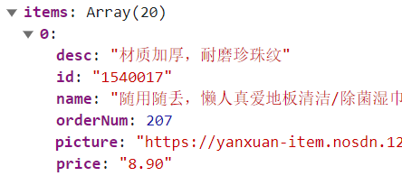

# 5-1需求分析与路由配置
## 步骤1：创建二级分类组件

创建SubCategory/index.vue

```vue
<script setup>


</script>

<template>
  <div class="container ">
    <!-- 面包屑 -->
    <div class="bread-container">
      <el-breadcrumb separator=">">
        <el-breadcrumb-item :to="{ path: '/' }">首页</el-breadcrumb-item>
        <el-breadcrumb-item :to="{ path: '/' }">居家
        </el-breadcrumb-item>
        <el-breadcrumb-item>居家生活用品</el-breadcrumb-item>
      </el-breadcrumb>
    </div>
    <div class="sub-container">
      <el-tabs>
        <el-tab-pane label="最新商品" name="publishTime"></el-tab-pane>
        <el-tab-pane label="最高人气" name="orderNum"></el-tab-pane>
        <el-tab-pane label="评论最多" name="evaluateNum"></el-tab-pane>
      </el-tabs>
      <div class="body">
         <!-- 商品列表-->
      </div>
    </div>
  </div>

</template>


<style lang="scss" scoped>
.bread-container {
  padding: 25px 0;
  color: #666;
}

.sub-container {
  padding: 20px 10px;
  background-color: #fff;

  .body {
    display: flex;
    flex-wrap: wrap;
    padding: 0 10px;
  }

  .goods-item {
    display: block;
    width: 220px;
    margin-right: 20px;
    padding: 20px 30px;
    text-align: center;

    img {
      width: 160px;
      height: 160px;
    }

    p {
      padding-top: 10px;
    }

    .name {
      font-size: 16px;
    }

    .desc {
      color: #999;
      height: 29px;
    }

    .price {
      color: $priceColor;
      font-size: 20px;
    }
  }

  .pagination-container {
    margin-top: 20px;
    display: flex;
    justify-content: center;
  }


}
</style>
```
## 步骤2：配置路由关系

重构router/index.js

注意事项：path: 'category/sub/:id', 二级路由前面没有/

```javascript
import SubCategory from '@/views/SubCategory/index.vue'
...
const router = createRouter({
  ...
    children:[
        {
          path: '',
          component: Home
        },
        {
          path: 'category/:id',
          component: Category
        },
        {
          path: 'category/sub/:id',
          component: SubCategory
        }
      ]
  ]
})

export default router
```
## 步骤3：跳转配置

重构Category/index.vue

注意事项：`/category/sub/${i.id}`前面必须要有个/进行拼接

```html
<div class="sub-list">
  <h3>全部分类</h3>
  <ul>
    <li v-for="i in categoryData.children" :key="i.id">
      <RouterLink :to="`/category/sub/${i.id}`">
        
        <p>{{ i.name }}</p>
      </RouterLink>
    </li>
  </ul>
</div>
```


# 5-2 实现二级面包屑导航

## 步骤1：创建API接口

重构apis/category.js

```javascript
/**
 * @description: 根据id获得二级分类对象信息
 * @param {*} id 分类id
 * @return {*}
 */
export function getCategoryFilterAPI(id){
    return http.get('/category/sub/filter',{params:{id}});
}

```

## 步骤2：获取数据渲染模版

重构SubCategory/index.vue

请求数据如下


```vue
<script setup>
import { getCategoryFilterAPI } from '@/apis/category'
import {useRoute} from "vue-router";

// 获取面包屑导航数据
const filterData = ref({})
const route = useRoute();
const getFilterData = async (id) => {
  const res = await getCategoryFilterAPI(id)
  filterData.value = res.result
}
onMounted(() => getFilterData(route.params.id))
</script>

<template>
  <div class="container ">
    <!-- 面包屑 -->
    <div class="bread-container">
      <el-breadcrumb separator=">">
        <el-breadcrumb-item :to="{ path: '/' }">首页</el-breadcrumb-item>
        <el-breadcrumb-item :to="{ path: `/category/${filterData.parentId}` }">{{filterData.parentName}}
        </el-breadcrumb-item>
        <el-breadcrumb-item>{{filterData.name}}</el-breadcrumb-item>
      </el-breadcrumb>
    </div>
      ...
```


# 5-3 实现分类基础列表

## 步骤1：创建API接口

重构apis/category.js

```javascript
/**
 * @description: 获取二级分类商品列表
 * @data {
     categoryId: 1005000 ,
     page: 1,
     pageSize: 20,
     sortField: 'publishTime' | 'orderNum' | 'evaluateNum'
   }
 * @return {*}
 */
export const getSubCategoryAPI = (data) => {
    return http.post('/category/goods/temporary',data);
}
```
## 步骤2：获取数据列表




重构SubCategory/index.vue

```vue
<script setup>
...  
// 获取二级分类商品
const goodList = ref([])
const reqData = ref({
  categoryId: route.params.id,
  page: 1,
  pageSize: 20,
  sortField: 'publishTime'
})
const getGoodList = async () => {
  const res = await getSubCategoryAPI(reqData.value)
  goodList.value = res.result.items
}
onMounted(() => getGoodList())
  
</script>
```

重构template

```vue
<div class="body">
  <!-- 商品列表-->
  <GoodsItem v-for="good in goodList" :good="good" :key="good.id"></GoodsItem>
</div>
```


# 5-4 实现列表条件筛选

> 思路：tab组件切换时修改reqData中的sortField字段，重新拉取接口列表

重构SubCategory/index.vue


```vue
<script setup>
 ...
// tab切换回调
const tabChange = () => {
  console.log('tab切换了', reqData.value.sortField)
  reqData.value.page = 1
  getGoodList()
}
</script>

<template>
  <el-tabs v-model="reqData.sortField" @tab-change="tabChange">
    <el-tab-pane label="最新商品" name="publishTime"></el-tab-pane>
    <el-tab-pane label="最高人气" name="orderNum"></el-tab-pane>
    <el-tab-pane label="评论最多" name="evaluateNum"></el-tab-pane>
  </el-tabs>
</template>
```


# 5-5 实现列表无限加载

> element-plus 
>
> https://element-plus.org/zh-CN/component/infinite-scroll.html#%E5%9F%BA%E7%A1%80%E7%94%A8%E6%B3%95
>
> 
>
> 基础思路
>
> 1. 触底条件满足之后 page++，拉取下一页数据
> 2. 新老数据做数组拼接
> 3. 判断是否已经全部加载完毕，停止监听
>


## 步骤1：加载下一页数据

重构template

```vue
<div class="body" v-infinite-scroll="load" >
        <!-- 商品列表-->
        <GoodsItem v-for="good in goodList" :good="good" :key="good.id"></GoodsItem>
</div>
```

重构script

```javascript
// 5-5 加载更多
const load = async () => {  
  // 获取下一页的数据
  reqData.value.page++
  console.log(reqData.value.page)
  const res = await getSubCategoryAPI(reqData.value)
  //新加载的数据与老数据进行拼接合并
  goodList.value = [...goodList.value, ...res.result.items]  
}
```


## 步骤2：无数据停止加载

重构template

```vue
<div class="body" v-infinite-scroll="load" :infinite-scroll-disabled="disabled">
        <!-- 商品列表-->
        <GoodsItem v-for="good in goodList" :good="good" :key="good.id"></GoodsItem>
</div>
```

重构script

```js
// 5-5 加载更多
const disabled = ref(false);
const load = async () => {
  console.log('加载更多数据咯')
  // 获取下一页的数据
  reqData.value.page++
  const res = await getSubCategoryAPI(reqData.value)
  //新加载的数据与老数据进行拼接合并
  goodList.value = [...goodList.value, ...res.result.items]
  // 加载完毕 停止监听
  if (res.result.items.length === 0) {
    disabled.value = true
  }
}
```